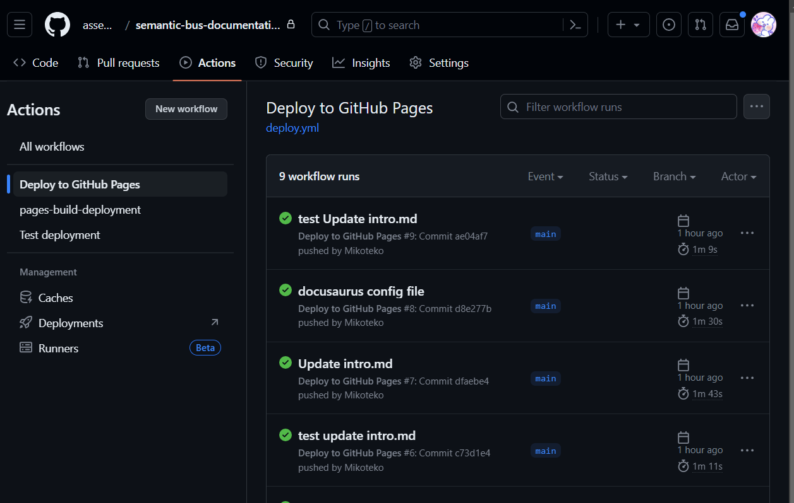

# Website

This website is built using [Docusaurus 2](https://docusaurus.io/), a modern static website generator.

#### https://assemblee-virtuelle.github.io/semantic-bus-documentation/

### Configurate your docusaurus config file 

docusaurus.config.js

This basic configuration is working for instance.
```js
module.exports = {
  title: 'Semantic Bus',
  tagline: 'Documentation of the Semantic Bus',
  url: 'https://assemblee-virtuelle.github.io',
  baseUrl: '/semantic-bus-documentation/',
  onBrokenLinks: 'warn',
  onBrokenMarkdownLinks: 'warn',
  favicon: 'img/favicon.ico',
  
  organizationName: 'assemblee-virtuelle', // Replace with your GitHub username
  projectName: 'semantic-bus-documentation', // Replace with your GitHub repository name
  deploymentBranch: 'gh-pages',
  trailingSlash: false,

  themeConfig: {
    navbar: {
      title: 'Semantic Bus',
      logo: {
        alt: 'Semantic Bus logo',
        src: 'img/logo.svg',
      },
      items: [
        {
          to: 'docs/',
          activeBasePath: 'docs',
          label: 'Docs',
          position: 'left',
        },
        // ...Other navigation items
      ],
    },
    footer: {
      style: 'dark',
      links: [
        // ...Footer links
      ],
    },
  },

  presets: [
    [
      '@docusaurus/preset-classic',
      {
        docs: {
          sidebarPath: require.resolve('./sidebars.js'),
          // Other options for the documentation
        },
        theme: {
          customCss: require.resolve('./src/css/custom.css'),
        },
      },
    ],
  ],
};
```

### Installation

```
$ yarn
```

### Local Development

```
$ yarn start
```

This command starts a local development server and opens up a browser window. Most changes are reflected live without having to restart the server.

### Build

```
$ yarn build
```

This command generates static content into the `build` directory and can be served using any static contents hosting service.

### Deployment

Is your docusaurus working locally? If so, you can do the further steps ->

[You can look at the documentation here](https://docusaurus.io/docs/deployment).

We have a branch called main with the docusaurus code/project.
The branch called gh-pages is created/updated automatically by a github bot.

First we have to create a github workflow.

In Settings -> General -> Pages : select Deploy from a branch and gh-pages /root.
In your main branch create a folder .github/workflows.

Create a new file named deploy.
This file will be the one to update every change in the main branch to the gh-pages branch.

Here is an example of a working yaml workflow file ->
Its name is "Deploy to Github Pages"

```yaml
name: Deploy to GitHub Pages

on:
  push:
    branches:
      - main
    # Review gh actions docs if you want to further define triggers, paths, etc
    # https://docs.github.com/en/actions/using-workflows/workflow-syntax-for-github-actions#on

jobs:
  deploy:
    name: Deploy to GitHub Pages
    runs-on: ubuntu-latest
    steps:
      - uses: actions/checkout@v3
      - uses: actions/setup-node@v3
        with:
          node-version: 18
          cache: yarn

      - name: Install dependencies
        run: yarn install --frozen-lockfile
      - name: Build website
        run: yarn build

      # Popular action to deploy to GitHub Pages:
      # Docs: https://github.com/peaceiris/actions-gh-pages#%EF%B8%8F-docusaurus
      - name: Deploy to GitHub Pages
        uses: peaceiris/actions-gh-pages@v3
        with:
          github_token: ${{ secrets.GITHUB_TOKEN }}
          # Build output to publish to the `gh-pages` branch:
          publish_dir: ./build
          # The following lines assign commit authorship to the official
          # GH-Actions bot for deploys to `gh-pages` branch:
          # https://github.com/actions/checkout/issues/13#issuecomment-724415212
          # The GH actions bot is used by default if you didn't specify the two fields.
          # You can swap them out with your own user credentials.
          user_name: github-actions[bot]
          user_email: 41898282+github-actions[bot]@users.noreply.github.com
```

Now you can try and update one of your documents.
If you see a green workflow in https://github.com/assemblee-virtuelle/semantic-bus-documentation/actions in the section Deploy to Github Pages it means that your update is on the gh-pages branch and this branch has been deployed as a github page. (You still need to check if the workflow pages build and deployment worked to see if the github page was successfully updated)




