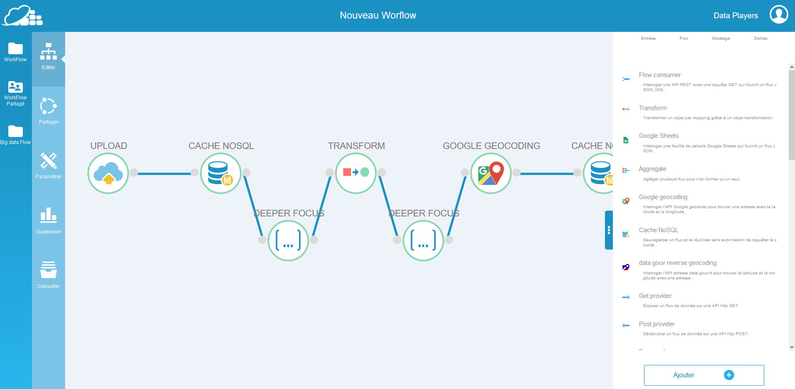
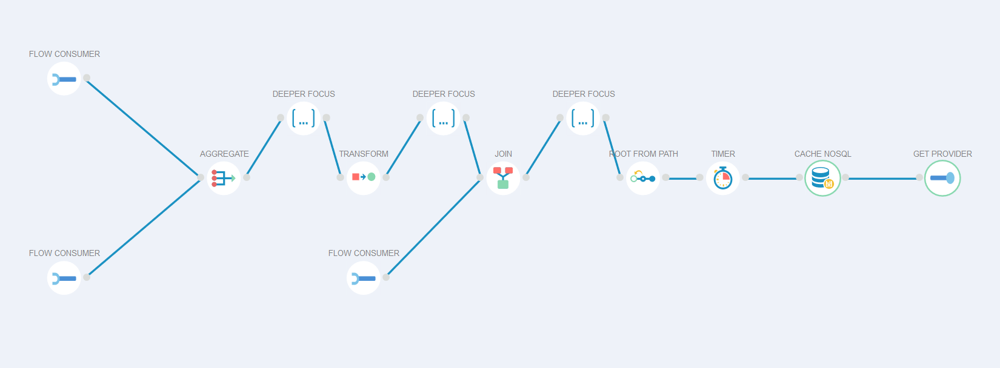

# Découvrez le Bus Sémantique !

L'interface graphique du Bus Sémantique offre une solution intuitive pour la conception, l'édition et la visualisation de traitements de données sans nécessiter de développement, le tout sur un graphe dynamique. 

Ce graphe, appelé Workflow, vous permet de parcourir chaque étape de votre traitement, offrant une vue d'ensemble ainsi que des détails spécifiques pour chaque tâche. Actuellement, nous proposons plus de trente composants répartis en trois catégories : les connecteurs d'entrées, qui peuvent interpréter une variété considérable de sources de données en flux poussé et tiré ; les gestionnaires de flux, qui effectuent diverses opérations sur les données et acheminent le flux traité d'un composant à un autre ; et enfin, les connecteurs de sorties, qui permettent d'exposer les flux de données traitées sur l'interface ou de les envoyer vers le support de votre choix. Ces composants assurent un suivi clair et précis de chaque étape de votre traitement, garantissant des résultats rapides et efficaces, même pour ceux qui ont peu d'expérience en programmation.
